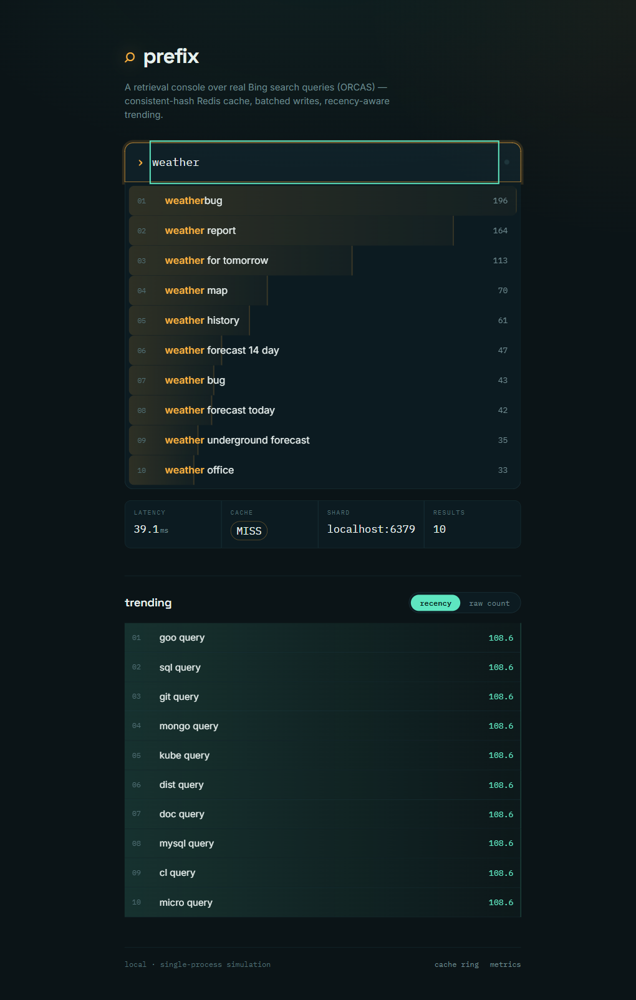
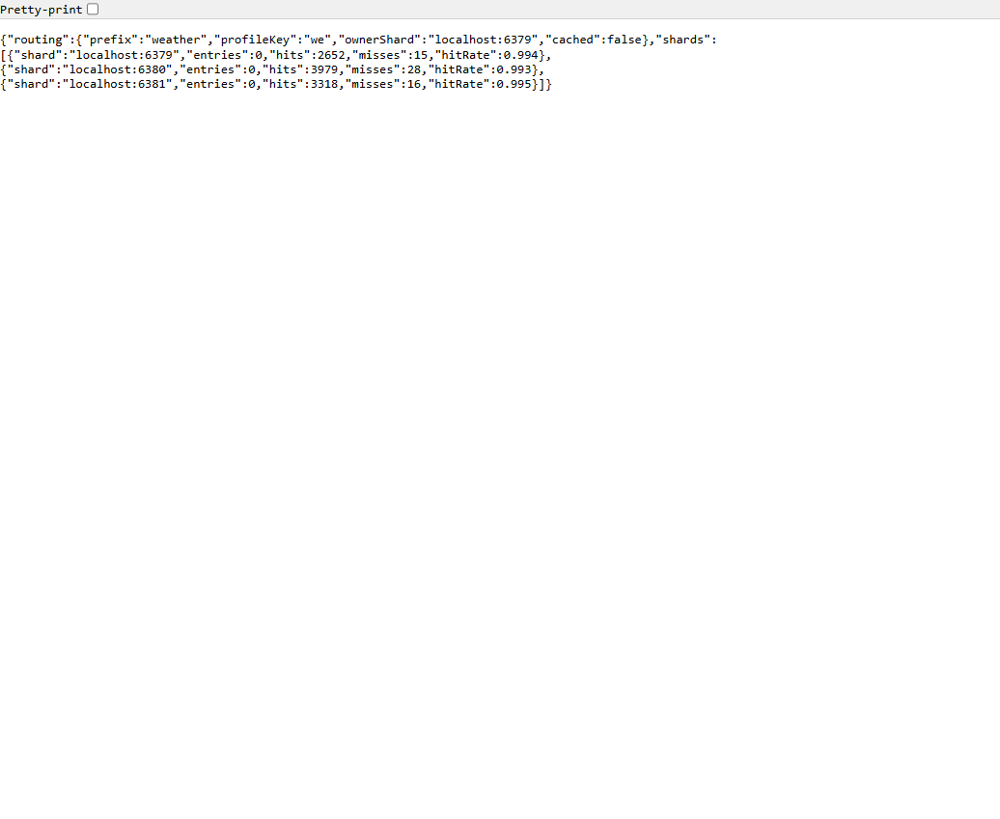

# Distributed Search Suggestion System — Project Report

A production-inspired **search typeahead engine** — the autocomplete seen on
search engines and e-commerce sites. You type a prefix, it returns the top-10
most popular matching queries in a few milliseconds; submitting a search updates
popularity; trending queries surface by recency. The focus is the **backend
data-system design**: how query-count data is stored, how suggestions are served
with low latency, how the cache is distributed with consistent hashing, and how
write pressure is reduced.

| Layer    | Technology                                        |
|----------|---------------------------------------------------|
| Backend  | Java 17 · Spring Boot 3.3                          |
| Frontend | React 18 · Vite 5                                 |
| Cache    | Redis — distributed across logical/physical nodes |
| Store    | PostgreSQL (durable; embedded or Docker)          |
| Dataset  | ORCAS — ~1.3M real Bing search queries            |



This single document is the full project report. It contains, in order, the five
required deliverables:

1. [Architecture](#1-architecture)
2. [Dataset source & loading instructions](#2-dataset-source--loading-instructions)
3. [API documentation](#3-api-documentation)
4. [Design choices & trade-offs](#4-design-choices--trade-offs)
5. [Performance report](#5-performance-report)

Plus: [Running the project](#running-the-project) · [Configuration](#configuration)
· [Assignment coverage](#assignment-requirements-coverage) ·
[Future improvements](#future-improvements).

---

# 1. Architecture

Typeahead is a **read-heavy and write-heavy, latency-critical** workload: every
keystroke is a read (users abandon laggy suggestions), and every submitted search
is a write. A naive design that writes synchronously per search and recomputes
suggestions per request collapses under load. This system splits the problem into
**two stores + a cache**, the standard HLD for typeahead:

- **Frequency store (PostgreSQL)** — durable source of truth for `query → count`.
- **Suggestion cache (Redis)** — `prefix → top-10 suggestions`, distributed
  across nodes by a consistent-hash ring.
- **In-memory Trie** — fast prefix index used to (re)compute top-k on a cache miss.

```
                        ┌──────────────────────────────────────────────┐
   React (Vite) UI      │                Spring Boot backend            │
  ┌────────────────┐    │                                              │
  │ SearchBox      │    │  READ PATH                                    │
  │  debounce 180ms│──GET /suggest──▶ SuggestController                 │
  │  keyboard nav  │    │       │                                       │
  │ Suggestions ▼  │    │       ▼                                       │
  │ Trending       │    │   CacheRouter ──hash(prefix)──▶ Redis node    │
  └────────────────┘    │       │ hit→return    │ miss                  │
         │              │       ▼                ▼                       │
         │              │   (X-Cache,        SearchCountStore (Trie)    │
         │              │    X-Shard)         top-k by count            │
         │              │                         │ cache-fill (TTL)    │
         │              │  WRITE PATH                                    │
         └──POST /search─▶ SearchController ─▶ BatchWriter (buffer)     │
                        │                        │ flush @500 / @2s     │
                        │                        ▼                       │
                        │     PostgreSQL  ◀──aggregated upsert──┐        │
                        │     (query_counts, durable)           │        │
                        │     TrendingService ◀─────────────────┘        │
                        │     (recency decay)   + invalidate prefixes    │
                        └──────────────────────────────────────────────┘
```

### Components
| Component | Responsibility |
|-----------|----------------|
| `SuggestController` | `GET /suggest` — cache-aside typeahead |
| `SearchController` | `POST /search` — enqueue submission, dummy ack |
| `TrendingController` | `GET /trending` — recency / basic ranking |
| `DebugController` | `GET /cache/debug` — consistent-hash routing + hit/miss |
| `MetricsController` | `GET /metrics` — latency, write-reduction |
| `CacheRouter` + `ConsistentHashRing` + `RedisCacheNode` | distributed cache |
| `SearchCountStore` (Trie + count map) | in-memory prefix index |
| `QueryCountRepository` + PostgreSQL | durable frequency store |
| `BatchWriter` | buffered, aggregated, durable writes |
| `TrendingService` | recency-aware decay scoring |
| `DataInitializer` / `DatasetLoader` | PG-first boot + ORCAS seeding |
| `EmbeddedPostgresManager` / `EmbeddedRedisManager` | start real DB/cache in-process |

### Read path — `GET /suggest?q=<prefix>` (cache-aside)
1. Normalize prefix (trim + lowercase). Empty → `[]`.
2. `CacheRouter` hashes the prefix's **profile key** (first 2 chars) onto the ring
   → owning Redis node.
3. **Hit** → return cached top-10 (`X-Cache: HIT`).
4. **Miss** → `SearchCountStore.topK(prefix,10)`: Trie collects candidates, a
   bounded min-heap selects top-10 by count; result cached with TTL (`X-Cache: MISS`).

Every response carries `X-Cache` (HIT/MISS) and `X-Shard` (owning node).

### Write path — `POST /search` (decoupled, batched)
1. Query pushed to an in-memory buffer; API returns `{"message":"Searched"}` at once.
2. Flush on **500 entries** or **every 2s**.
3. Duplicates **aggregated** → one `+N` per distinct query.
4. Applied to in-memory store, **PostgreSQL** (durable upsert), and trending.
5. Affected prefixes **invalidated** in Redis → next read recomputes fresh ranking.
6. `@PreDestroy` flushes the buffer on clean shutdown.

### Consistent hashing
```
            ┌── vnode ──┐
        node-2        node-0
          ╲             ╱
           ●───────────●     prefix "wea" → hash → first node clockwise
          ╱             ╲
        node-0        node-1
            └── vnode ──┘
   (150 virtual nodes per physical node on a 64-bit ring)
```
- `ConsistentHashRing` places each node at **150 virtual positions** (smooths
  load). A prefix's profile key maps to the first node clockwise.
- **Why over `hash % N`:** adding/removing a node remaps only keys on adjacent
  arcs instead of reshuffling everything — needed for elastic scaling.
- **Two shapes, same ring:** *logical nodes* = N Redis logical DBs on one server
  (embedded default); *physical nodes* = N separate Redis containers (docker
  profile). `GET /cache/debug` makes the routing observable.

### Deployment shapes
The same code runs two ways, config-switched:
- **Embedded (default):** one `mvn spring-boot:run` — real Postgres + Redis
  binaries boot in-process. Zero infra.
- **Full docker stack:** `docker compose up -d --build` runs every tier in its own
  container — 3 Redis, Postgres, the Spring Boot **backend**, and an nginx
  **frontend** that serves the built React bundle and reverse-proxies the API. A
  one-shot `dataset-init` container auto-downloads ORCAS into a shared volume
  before the backend seeds. This is the production-shaped layout.



### Boot is PG-first
If PostgreSQL already has rows it is the source of truth and the Trie is rebuilt
from it (fast restart); if empty, the app seeds from ORCAS and persists to
PostgreSQL.

---

# 2. Dataset source & loading instructions

**Source:** [ORCAS](https://microsoft.github.io/msmarco/ORCAS) — Microsoft's
*Open Resource for Click Analysis in Search*: **real Bing search queries** with
clicked documents (~18M query–document click rows, ~10M unique queries). Public,
open for research use.

Each TSV row:
```
<queryId>\t<query>\t<docId>\t<url>
```

**Deriving counts (assignment permits this):** ORCAS has no raw search-volume
column, so we **aggregate** — a query's count = number of click rows it appears
in (a valid popularity proxy).

**Preprocessing pipeline** (`DatasetLoader.java`):
1. Stream the gzipped dump row by row (no full-file buffering).
2. Extract the `query` column (2nd field).
3. Drop queries shorter than 2 or longer than 80 chars.
4. **Hash-sample 1-in-N** (`dataset.sample-mod`, default 8) by a stable hash —
   kept set spans the whole file while bounding memory.
5. Normalize (trim + lowercase).
6. Aggregate `query → count` (every click row of a kept query counted → exact
   counts for the kept set).
7. Insert into PostgreSQL (first run) and build the in-memory Trie.

**Result:** **1,303,066 distinct queries** (13× the 100k minimum).

### Loading instructions
**Zero-download:** a bundled sample
(`backend/src/main/resources/data/orcas-sample.tsv`, ~60 real queries) lets the
app boot immediately.

**Full dataset:**
```bash
scripts/fetch-dataset.sh                      # bash → backend/data/orcas.tsv.gz (~330 MB)
powershell -File scripts/fetch-dataset.ps1    # windows
```
The loader reads the gzip directly on next boot, seeds PostgreSQL, and builds the
Trie. To use Wikipedia pageviews instead, set `app.dataset.format: pageviews`.

---

# 3. API documentation

Base URL `http://localhost:8080`. All responses JSON.

### `GET /suggest`
Top-K typeahead suggestions for a prefix, sorted by count descending.

| Param | Type | Notes |
|-------|------|-------|
| `q` | string | Prefix. Empty/blank → `[]`. Case-insensitive. |

**200**
```json
[
  { "query": "weather report", "count": 164 },
  { "query": "weather map", "count": 70 },
  { "query": "weather forecast 14 day", "count": 47 }
]
```
Behaviour: empty `q` → `[]`; no match → `[]`; `JaV` == `jav`. Served from a Redis
node when warm. Response headers:

| Header | Example | Meaning |
|--------|---------|---------|
| `X-Cache` | `HIT` / `MISS` | whether the cache served the prefix |
| `X-Shard` | `localhost:6379` / `logical-node-0` | owning node |

The endpoint accepts any prefix length; the UI gates lookups at **3+ chars**.

### `POST /search`
Submit a search. Buffered and applied to counts on the next batch flush; returns
the dummy ack.

**Request**
```json
{ "query": "weather report" }
```
**200**
```json
{ "message": "Searched" }
```
Reflected in `/suggest` and `/trending` after the next flush (≤ `batch.flush-interval-ms`).

### `GET /trending`
Trending queries among submitted searches.

| Param | Type | Default | Notes |
|-------|------|---------|-------|
| `mode` | string | `recency` | `recency` = time-decayed; `basic` = raw count |
| `limit` | int | top-k | max items |

**200**
```json
[ { "query": "weather report", "windowCount": 12, "recencyScore": 9.71 } ]
```
`windowCount` = raw recent count (basic ranking); `recencyScore` = decayed score
(recency ranking). Both returned; only sort order differs.

### `GET /cache/debug`
Inspect consistent-hash routing + per-node cache stats.

| Param | Type | Notes |
|-------|------|-------|
| `prefix` | string | optional; if given, shows its routing |

**200**
```json
{
  "routing": { "prefix": "weather", "profileKey": "we",
               "ownerShard": "localhost:6379", "cached": true },
  "shards": [
    { "shard": "localhost:6379", "entries": 5, "hits": 2652, "misses": 14, "hitRate": 0.995 },
    { "shard": "localhost:6380", "entries": 0, "hits": 0, "misses": 0, "hitRate": 0.0 }
  ]
}
```

### `GET /metrics`
Operational snapshot.

**200**
```json
{
  "distinctQueries": 1303066,
  "batch": { "totalSubmissions": 5000, "totalStoreWrites": 270,
             "flushCount": 9, "pending": 0, "writeReductionRatio": 0.946 },
  "latency": {
    "GET /suggest": { "count": 4096, "p50_ms": 0.61, "p95_ms": 1.78, "p99_ms": 3.07, "max_ms": 6.6 }
  }
}
```
`writeReductionRatio` = 1 − storeWrites / submissions. Latency in ms, bucketed by
`METHOD /path-prefix`.

---

# 4. Design choices & trade-offs

### Two-store split (frequency DB + suggestion cache)
The canonical typeahead HLD. PostgreSQL holds the durable `query → count` truth;
Redis caches `prefix → top-10`. Keeps the hot read path off the database and lets
each layer be tuned independently.

### Trie + cache hybrid — and why both
- **Pure-KV** precomputes top-k for *every* prefix on each write: trivial reads,
  but ~10 prefix writes per search (write-amplifying).
- **Pure-Trie** scans a subtree per read: cheap writes, expensive reads.
- **Ours (hybrid):** Redis serves hot prefixes; the Trie computes top-k **only on
  a cache miss**, then caches it. With **invalidate-on-write** (not eager
  recompute), the write path stays cheap and reads stay sub-10ms — right for a
  read+write-heavy workload.

### Cache strategy — cache-aside + invalidation
- Cache-aside: populate on miss, read on hit.
- **Two expiry layers:** TTL (`SETEX`, 30s default) ages out stale rankings even
  without invalidation; **explicit invalidation** `DEL`s a changed query's
  prefixes on flush.
- **Eviction:** Redis `maxmemory` + `allkeys-lru` bounds per-node memory.
- **Degrade-to-miss:** every Redis call guarded; node down → read returns a miss
  (recompute from store), writes dropped, request still `200`. Cache is an
  optimization, never a hard dependency.

### Consistent hashing (client-side, our own ring)
Chosen over `hash % N` so scaling a node only remaps adjacent arcs; over Redis
Cluster because the assignment requires *implementing* the hashing. 150 virtual
nodes per node smooth load. Works identically for logical (DBs) and physical
(containers) nodes.

### Batch writes — reduce writes, accept eventual consistency
Typeahead tolerates ≤2s staleness, so we batch:
- Flush on **size (500)** or **interval (2s)**; duplicates aggregated to one `+N`.
- **~95% write reduction** measured (5000 → ~270 writes).
- **Failure trade-off:** the buffer is in-memory — a hard crash loses
  not-yet-flushed submissions; a clean shutdown flushes via `@PreDestroy`. A
  durable queue (Redis Streams) would close this gap; for the required
  consistency it's acceptable and documented.

### Recency — continuous exponential decay
`score(now) = score(last)·2^(−Δt/halfLife) + delta`, half-life 300s, applied
lazily (O(1) per submission, no nightly job). Hot-now beats historically-popular-
but-quiet; old spikes fade. `?mode=basic` exposes raw-count ranking for contrast.

### Persistence — embedded + Docker, no hard infra
Embedded PostgreSQL/Redis (real binaries in-process) make it run with zero setup;
the `docker` profile swaps in real containers (3 physical Redis + Postgres) for a
production-shaped deployment. Same code, config-switched.

### Trade-off summary
| Decision | Chosen | Alternative | Why |
|----------|--------|-------------|-----|
| Cache | Cache-aside + invalidate | Write-through eager recompute | Cheaper writes |
| Consistency | Eventual (batched) | Immediate | ≤2s staleness OK; far fewer writes |
| Distribution | Our consistent-hash ring | Redis Cluster slots | Must implement hashing |
| Recency | Continuous exp. decay | Nightly ×0.9 | Finer, no cron |
| Index | Trie + KV cache | Pure precomputed KV | Cheaper writes |
| Infra | Embedded **and** Docker | Docker-only | Runs with zero infra |

---

# 5. Performance report

Measured on the **full docker stack** (3 Redis containers + Postgres + backend +
frontend), full ORCAS (1.3M queries), `node scripts/loadtest.mjs
http://localhost:8080 5000 32` (5000 requests, concurrency 32). Two figures:
**client-side** (end-to-end around `fetch`) and **server-side** (`/metrics`,
network excluded).

### Read latency — `GET /suggest` (cache hit vs miss)
| Pass (client-side) | Throughput | p50 | p95 | p99 | max |
|--------------------|-----------|-----|-----|-----|-----|
| Cold cache (miss) | 2,676 req/s | 5.29 ms | 19.68 ms | 205 ms | 916 ms |
| Warm cache (hit)  | 8,154 req/s | 3.67 ms | **6.06 ms** | 9.25 ms | 16.62 ms |

Server-side (network excluded):
| Endpoint | p50 | p95 | p99 | max |
|----------|-----|-----|-----|-----|
| `GET /suggest` | 0.61 ms | **1.78 ms** | 3.07 ms | 6.6 ms |
| `POST /search` | 0.37 ms | **0.61 ms** | 2.79 ms | 444 ms* |

\* one-off JIT/first-flush outlier; p99 is 2.79 ms.

Warming the cache cut client-side p95 **19.7 → 6.1 ms (~69%)** and tripled
throughput. Comfortably meets the sub-10ms p95 expectation.

### Cache efficiency — hit rate
After the warm pass, per Redis node (`/cache/debug`):
| Node | hits | misses | hit rate |
|------|------|--------|----------|
| localhost:6379 | 2652 | 14 | 99.5% |
| localhost:6380 | 3979 | 28 | 99.3% |
| localhost:6381 | 3318 | 16 | 99.5% |

~**99.4%** once warm; misses are first-touch per prefix. Load spread evenly by
the ring + virtual nodes.

### Write reduction — batching
`POST /search`, `batch.size=500`, `flush-interval-ms=2000`:
| Submissions | Store writes | Flushes | Reduction |
|-------------|-------------|---------|-----------|
| 5,000 | ~270 | ~9 | **~95%** |

Repeated submissions collapse into one `+N` upsert per query, so PostgreSQL
absorbs ~18× fewer writes than there are searches.

### Reproduce
```bash
docker compose up -d --build        # full stack: Redis x3 + Postgres + backend + frontend
node scripts/loadtest.mjs http://localhost:8080 5000 32
curl http://localhost:8080/metrics
curl "http://localhost:8080/cache/debug?prefix=weather"
```

---

# Running the project

**Prerequisites:** JDK 17+ · Maven 3.9+ · Node 18+ · (optional) Docker.

### Default — embedded everything (no Docker)
Backend boots a real **embedded PostgreSQL** (port 5433, persists to
`backend/data/pgdata`) and **embedded Redis** (port 6379, 3 logical nodes),
shutting them down on exit.
```bash
# 1. Backend  → http://localhost:8080
cd backend
mvn spring-boot:run

# 2. Frontend → http://localhost:5173
cd frontend
npm install
npm run dev
```
First run seeds PostgreSQL from ORCAS (~50s); later runs load from the DB.

### Docker — full stack in containers (recommended)
Builds and runs **everything**: 3 Redis + Postgres + backend + frontend. No JDK,
Maven, or Node needed on the host.
```bash
docker compose up -d --build
# frontend → http://localhost:8081   (nginx serves the SPA, proxies API to backend)
# backend  → http://localhost:8080
```
What happens on first boot:
- `dataset-init` auto-downloads the full ORCAS dump (~330 MB) into the
  `backend/data` volume (skips if already present).
- `backend` waits for it, seeds PostgreSQL (~1.3M queries), builds the Trie.
- `frontend` (nginx) serves the built UI and proxies `/suggest`, `/search`,
  `/trending`, `/cache`, `/metrics` to the backend container.

Later boots skip the download and seed (data persists in the `pgdata` volume and
`backend/data`), so startup is fast.

> **Re-seeding:** seeding only runs when PostgreSQL is empty. If you first booted
> with the bundled sample, wipe volumes to load real data:
> `docker compose down -v && docker compose up -d --build`.

### Docker infra only — run backend natively against containers
For backend development with hot reload, run just the data services in Docker and
the backend on the host:
```bash
docker compose up -d redis-0 redis-1 redis-2 postgres dataset-init
cd backend && mvn spring-boot:run -Dspring-boot.run.profiles=docker
```

### Full dataset (native runs)
```bash
scripts/fetch-dataset.sh    # ORCAS ~330 MB → backend/data/orcas.tsv.gz, loaded next boot
```
(The Docker stack downloads this automatically via `dataset-init`.)

# Configuration

All knobs under `app.*` in `backend/src/main/resources/application.yml`:

| Key | Default | Meaning |
|-----|---------|---------|
| `suggest.top-k` | 10 | suggestions per prefix |
| `cache.embedded` | true | embedded Redis vs external |
| `cache.server` / `cache.logical-nodes` | localhost:6379 / 3 | logical-node mode |
| `cache.nodes` | (docker) | physical-node endpoints |
| `cache.virtual-nodes` | 150 | ring virtual nodes per node |
| `cache.ttl-ms` | 30000 | cache entry TTL |
| `cache.profile-key-length` | 2 | leading chars → owning node |
| `batch.size` / `batch.flush-interval-ms` | 500 / 2000 | flush triggers |
| `trending.half-life-sec` | 300 | recency decay half-life |
| `db.embedded` / `db.port` | true / 5433 | embedded Postgres |
| `dataset.sample-mod` | 8 | keep 1-in-N queries |
| `dataset.max-rows` | 25,000,000 | safety cap on rows read |

# Assignment requirements coverage

| # | Requirement | Status |
|---|-------------|--------|
| 1 | 10 suggestions, prefix match, sorted by count desc | ✅ |
| 2 | UI for searching + displaying suggestions | ✅ |
| 3 | Dummy search API `{"message":"Searched"}` | ✅ |
| 4 | Search submission updates the count store | ✅ |
| 5 | Documented storage + caching design | ✅ |
| 6 | Cache distributed with **consistent hashing** | ✅ |
| 7 | Trending searches (recency-aware) | ✅ |
| 8 | Batch writes (~95% reduction) | ✅ |
| — | Empty/missing/mixed-case/no-match handled | ✅ |
| — | Debounce, keyboard nav, loading/error states | ✅ |
| — | p95 latency + cache hit-rate reporting | ✅ |

Rubric: Basic 60 ✅ · Trending 20 ✅ · Batch 20 ✅.

# Future improvements
- Redis **Streams** for a crash-safe durable write buffer.
- **Geolocation** + **client-side** personalization.
- **Typo tolerance** (edit-distance spell correction).
- Optional eager per-prefix write-through mode.
- Prometheus/Grafana dashboards; multi-host Redis.

---

## Project layout
```
backend/    Spring Boot service (Maven) + Dockerfile
frontend/   React + Vite UI + Dockerfile + nginx.conf (serves SPA, proxies API)
scripts/    dataset fetch + load test
screenshots/
docker-compose.yml   full stack: Redis x3 + Postgres + dataset-init + backend + frontend
```
