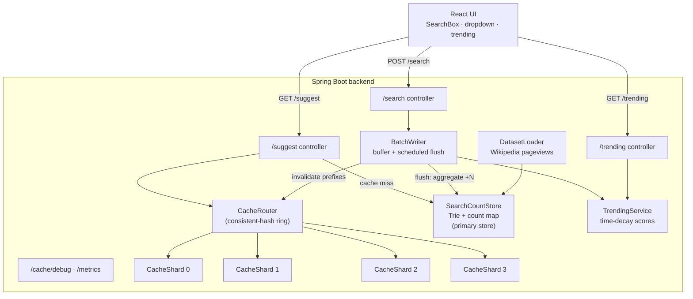

# Architecture & Design Decisions

The system is one Spring Boot process that **simulates** a distributed
typeahead service. Distribution is modelled in-process (cache shards on a
consistent-hash ring, a background batch-writer thread) so it runs locally yet
the design maps cleanly onto a real multi-node deployment.

## Request flows

### `GET /suggest?q=<prefix>`
1. Normalize prefix (trim + lowercase). Empty → `[]`.
2. `CacheRouter` hashes the prefix's **profile key** (first 2 chars) onto the
   ring → owning shard. **Hit** → return cached list.
3. **Miss** → `SearchCountStore.topK`: Trie collects candidate queries for the
   prefix, a bounded min-heap selects the top-K by count. Result is cached
   (with TTL) on the owning shard, then returned.

### `POST /search {query}`
1. Enqueue the query in the `BatchWriter` buffer; immediately return the dummy
   `{"message":"Searched"}`. The caller never waits for a store write.
2. The background flush aggregates duplicates and applies one `+N` increment per
   distinct query to the store, records them in trending, and invalidates the
   affected cache prefixes.

## Key design decisions & trade-offs

### Data model — Trie + count map
- **Trie** answers "which queries start with this prefix" in O(prefix length).
  **Count map** (`ConcurrentHashMap`) is the authoritative search count.
- Ranking is done by a **bounded heap** over the candidate set, so we never sort
  the whole dataset. A `MAX_CANDIDATES` cap protects against a very broad prefix
  (e.g. "e") fanning out to the entire keyspace — the trade-off is that for such
  a prefix the top-K is "best within the first N candidates", which the cache
  then serves for free on repeats.

### Caching — consistent hashing
- N shards (`app.cache.shards`) are placed on a ring with `virtual-nodes` points
  each. A prefix's **profile key** (leading chars) chooses the shard, so related
  prefixes (`ja`, `jav`, `java`) land on the **same** shard and keep its working
  set warm.
- **Why consistent hashing** over `hash % N`: adding/removing a shard remaps only
  the keys on the adjacent ring arcs instead of reshuffling every key — the
  property a real distributed cache needs for elastic scaling. Virtual nodes keep
  the per-shard load balanced. `GET /cache/debug` exposes the owning shard and
  per-shard hit/miss so this is observable.
- **Eviction**: each entry has a TTL (`ttl-ms`); shards also cap size with LRU.
  So the cache "does not remain forever" and stale rankings age out even without
  an explicit invalidation.

### Cache invalidation vs. freshness
- On flush, every prefix of a changed query is invalidated on its owning shard,
  so the next `/suggest` recomputes fresh ranking. Combined with TTL this gives
  two freshness guarantees: **immediate** for queries touched this flush, and
  **eventual** (≤ TTL) for everything else.
- **Trade-off (freshness vs. latency)**: a longer TTL and a larger batch window
  mean fewer recomputes and fewer store writes (lower latency / load) but staler
  counts. The knobs (`ttl-ms`, `batch.size`, `flush-interval-ms`) make this an
  explicit dial.

### Batch writes
- Typeahead traffic submits the same queries repeatedly in bursts. The
  `BatchWriter` buffers submissions and flushes when the buffer hits
  `batch.size` **or** every `flush-interval-ms`, aggregating duplicates into a
  single `+N` write. This cut store writes by **~94%** under load test
  (see PERFORMANCE.md).
- **Trade-off**: counts are **eventually consistent** — a just-submitted query
  is not reflected in suggestions/trending until the next flush. For typeahead
  that delay is invisible; the UI shows an acknowledgement explaining it.
- **Durability**: a `@PreDestroy` final flush drains the buffer on shutdown so no
  submissions are lost on a clean stop. (A real system would persist the buffer
  to a durable queue to also survive crashes — called out as a known limitation.)

### Trending — recency-aware ranking
- Each submission adds `1.0` to a query's score, but older contributions decay:
  `score(now) = score(last) · 2^(−Δt / halfLife) + delta`. Decay is applied
  lazily (only when a query is touched or read), so it's O(1) per submission.
- **Why recency matters**: a historically huge query would permanently dominate a
  raw-count ranking. Decay lets a query that is hot *right now* surface above a
  popular-but-quiet one. `GET /trending?mode=basic` returns the raw-count ranking
  so both approaches are visible side by side (assignment §7).

### Performance instrumentation
- A servlet filter times every request into a per-endpoint ring buffer;
  `GET /metrics` reports p50/p95/p99 and the batch write-reduction ratio.

## Mapping to a real distributed deployment
| Simulated here              | Real system                              |
|-----------------------------|------------------------------------------|
| In-memory cache shards      | Separate cache nodes (e.g. Redis) on a hash ring |
| Background batch-writer      | Stream consumer flushing to a database  |
| `SearchCountStore`          | Sharded/replicated datastore             |
| Profile-key routing         | Client- or proxy-side consistent hashing |
